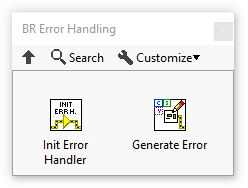
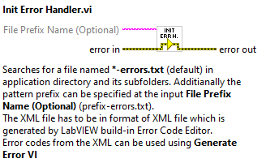
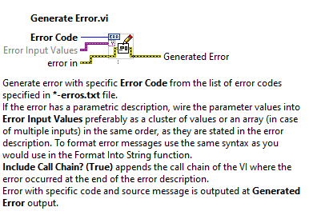
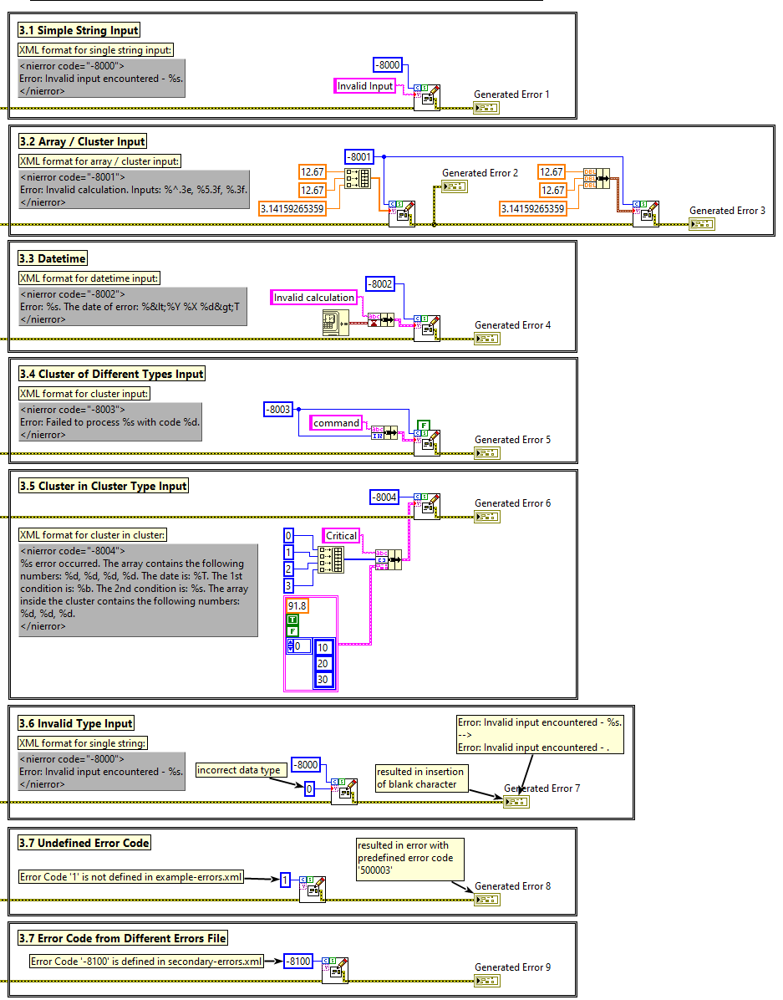

# BR Error Handling package

## What is this good for? Why should I use it?

The BR Error Handling package offers improved functionality for custom errors in LabVIEW projects. It addresses several limitations associated with the built-in function of custom error codes in LabVIEW.

Using the BR Error Handling package brings several benefits. Firstly, it provides a more organized approach to managing custom error codes and their descriptions within LabVIEW project. This helps in better categorization and documentation of error codes, making them easier to understand and maintain.

Furthermore, the package solves the issue of fixed file locations for storing custom error information. Unlike LabVIEW's default setup, which relies on a text file located in the LabVIEW installation folder, the BR Error Handling package allows direct use of file located in the project directory structure. This enables seamless collaboration and version control of error codes across multiple developers.

Another advantage is that the BR Error Handling package eliminates the need to restart LabVIEW when adding new error codes. This saves time and streamlines the development process by enabling dynamic addition and modification of error codes without interrupting the workflow.

Additionally, the package offers features like formatting the inputs to the error string, centralization of error codes within a project-specific text file, easy traceability of error codes in code, and efficient mass editing of error codes. These capabilities enhance code readability, maintainability, and facilitate error handling in LabVIEW projects.

In summary, utilizing the BR Error Handling package provides a more organized, collaborative, and efficient approach to managing custom errors in LabVIEW, overcoming the limitations of the default error code functionality.

## Installation

By following these steps, you can install the package using VIPM either by directly downloading the VIP file or by building the package from its source using the VIPB file.

### To install the package using the VI Package Manager (VIPM), follow these steps

This approach assumes you can get the package as a VIP file from website or repository.

1. **Download and install VIPM:** Visit the VIPM website (<https://vipm.jki.net/>) and download the appropriate version of VIPM for your LabVIEW installation. Follow the installation instructions provided.
2. **Download the package (VIP):** If the package is available for download, obtain the VIP file from the source. You can usually find the VIP file on the package's website or repository.
3. **Launch VIPM:** Open VIPM from your LabVIEW installation or via the desktop shortcut.
4. **Install the package:** In the VIPM window, click on the "Install" button. This will open the package installation dialog.
5. **Locate the VIP file:** In the package installation dialog, browse to the location where you downloaded the VIP file in step 2. Select the VIP file and click "Open".
6. **Review package information:** VIPM will display information about the package, including its name, version, and dependencies. Review this information to ensure compatibility with your LabVIEW installation.
7. **Confirm installation:** Click the "Install" button to begin the package installation process. VIPM will handle the installation and notify you when it's complete.

### To create VIP package from source code

If the package is not available for download as a VIP file, an alternative method is to build the package using the build specification (VIPB) file. This approach assumes you can get the package source codes and VIPB file.

1. **Download the package source code** and obtain the build specification file (.vipb)
2. **Launch VIPM:** Open VIPM from your LabVIEW installation or via the desktop shortcut
3. **Build the package:** In the VIPM window, click on the "Build" button. This will open the package build dialog.
4. **Locate the VIPB file:** In the package build dialog, browse to the location where you have the package's build specification (VIPB) file. Select the VIPB file and click "Open".
5. **Configure build options:** VIPM will present options for configuring the package build process. Customize the options according to your preferences and project requirements.
6. **Build the package:** Click the "Build" button to initiate the package build process. VIPM will compile the package and generate the VIP file.
7. **Install the package:** Once the package is built, follow the installation steps described earlier to install the package using the generated VIP file.

## What you get

Once the package is installed, you can find all files of the package in the `[LabVIEW install dir]\vi.lib\Bender Robotics\BR Error Handling folder`. From the LabVIEW developer's perspective the installed package consists of two VIs - the `Generate Error.vi` and the `Init Error Handler.vi` which can be found in Function palette in Bender Robotics sub-menu:



## How to Use BR Error Handling Package

First of all, you need to create an XML file with your custom errors, which you want to use in your project. Second, you need to use `Init Error Handler.vi` to initialize the functionality. And finally, you can call `Generate Error.vi` repeatedly whenever you need to generate custom error in your code. A detailed description of these three steps follows:

1. Create an XML File
   - To utilize BR Error Handler, you need to create an XML file that stores all custom error codes.
   - The XML file should follow the format of the XML file generated by LabVIEW's built-in Error Code Editor (`Tools -> Advanced -> Edit Error Codes...`).
   - You can generate and edit the XML file using the built-in **LabVIEW Error Code Editor** or any other text editor.
   - **Save the file** to the **project directory** or any of its subdirectories.
   - You can define **multiple files** storing Error Codes
   - Refer to the included example file [`example-errors.xml`](/sw/example-errors.xml) or the example below:

     ```xml
      <?xml version="1.0" encoding="ISO-8859-1"?>
      <nidocument>
      <nicomment>

      <nifamily familyname="Error Handler Example Error Codes" displayname="Example Error Codes">
      </nifamily>
      </nicomment>
      <nierror code="-8000">
      Error: Invalid input encountered - %s.
      </nierror>
      <nierror code="-8001">
      Error: Invalid calculation. Inputs: %^.3e, %5.3f, %.3f.
      </nierror>
      <nierror code="-8002">
      Error: %s. The date of error: %&lt;%Y %X %d&gt;T
      </nierror>
      <nierror code="-8003">
      Error: Failed to process %s with code %d.
      </nierror>
      <nierror code="-8004">
      %s error occurred. The array contains the following numbers: %d, %d, %d, %d. The date is: %T. The 1st condition is: %b. The 2nd condition is: %s. The array inside the cluster contains the following numbers: %d, %d, %d.
      </nierror>
      </nidocument>
     ```

3. Initialize the BR Error Handler
   - The Error Handler must be initialized before calling the `Generate Error` VI.
   - To initialize the BR Error Handler, use the `Init Error Handler` VI.

        
   - This VI searches for a files named **'*-errors.xml'** in the current project application directory and subdirectories and prepares these errors for further usage. Additionally, you can specify the name of the files at the **File Names (Optional)** input.
   - Call this VI only once per project.

4. Use the Generate Error Function
   - Once the Error Handler is initialized, you can use the **Generate Error** VI.

        
   - This VI generates an error based on the **Error Code** given as input and its match with the error code specified within the XML file. If the error code does not match with the errors specified in the XML file, the **Unspecified error occurred. Missing XML error file or wrong error code given.** with error code **500003** is generated.
   - Error message strings can be formatted. Use the **Format Specifier Syntax** rules as you would normally use for the *Format Into String* LabVIEW function. You **can** use *arrays* and *clusters* with this function; however, in the XML file, each array/cluster element must have its individual Conversion Code Syntax element.
   - **Format Specifier Syntax**:

   ```
   %[$][-][+][#][^][0][Width][.Precision || _SignificantDigits][{Unit}]<Embedded information> Conversion Code
   ```

   Double brackets ( [ ] ) enclose optional elements. For more details check the Format Specifier Syntax in LabVIEW Help or online documentation available here: <https://www.ni.com/docs/en-US/bundle/labview/page/lvconcepts/format_specifier_syntax.html>

## Examples

You can format error messages with a single element or multiple elements inputted as an array or cluster of various data types. Refer to the **Example.vi** and the attached **example-errors.txt** file.



## Limitations

1. Dependency on XML Format: The BR Error Handler relies on the XML format for storing custom error codes. This can be a limitation if you are not familiar with XML or prefer a different format for error code management.
2. Manual XML File Creation: Creating the XML file manually can be a time-consuming task, especially for projects with a large number of custom error codes. It requires careful formatting and adherence to the XML structure.
3. Limited Error Code Validation: The BR Error Handler validates error codes based on the XML file provided. If there are errors or inconsistencies in the XML file, it may not detect them during runtime. It's crucial to ensure the accuracy and completeness of the XML file to avoid unexpected behavior.
4. No Error Code Hierarchy: The BR Error Handler does not support hierarchical error codes. All error codes are treated as individual entities without any hierarchical relationship. This may not be suitable for projects that require a hierarchical structure for error handling and classification.

## Development Requirements

- **LabVIEW 2021 SP1 (32-bit)**

- **OpenG String Library by OpenG** (ver. 6.0.2.35) - Library package containing several routines for operating on strings and is used in this project. This toolkit is installed via [VIPM](https://www.vipm.io/). Available to download from here: [OpenG String Library by OpenG](https://www.vipm.io/package/oglib_string/) or directly via VIPM.

## Releases

### v0.0.4.11 (released on 2024 11 29)

- fix readme
- update versions of dependencies stated in the vipc file
- add BSD-3 license file

### v0.0.4.10 (released on 2024 08 13)

- update algorithm of searching for XML file with error codes

### v0.0.3.9 (released on 2024 08 09)

- bug fix, number of created error is not changed when XML file does not exist

### v0.0.3.7 (released on 2024 05 29)

- XML file is searched also in current VI's path

### v0.0.3.6 (released on 2024 05 17)

- add vipc file to repository

### v0.0.3.5 (released on 2023 11 06)

- add support for multiple XML files with error codes definitions in one project
- add Example.vi to the palette together with Init Handler.vi and Generate Error.vi
- update example
- update help in readme.md
- fix date&time formatting bug
- fix string placeholders parsing

### v0.0.2.2 (released on 2023 05 18)

- add dot character as a formatter delimiter
- update call chain not included by default
- update implementation improvements

### v0.0.1.1 (released on 2023 04 20)

- first stable release
