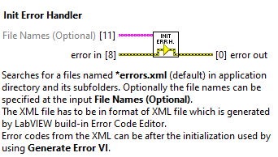
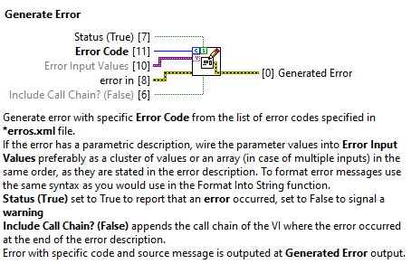

# BR LabVIEW Error Handling
BR Error Handling is a LabVIEW library (lvlibp) that improves the ease of use of custom errors in LabVIEW projects. Generally, the main aim of the library is to help organize used custom error codes and its description. 

Using the built-in function of custom error codes in LabVIEW brings a number of pitfalls, such as the fixed location of a text file that carries information about custom errors in the LabVIEW installation folder, thus preventing any direct use in a team using a git repository. Additionally, LabVIEW must be restarted whenever a new error code is added.

The BR Error Handling library overcomes the mentioned disadvantages and allows using all the advantages like **formatting the inputs** to the error string, centralization of the used error codes for the given project in a **text file**, **easily traceable** error codes in code, and **mass editing** of the error codes.

## Installation
To use the library, clone the git repository from [here](https://gitlab.benderrobotics.com/br/labview-team/br-labview-error-handling) and from the repository copy the library file named **error_handling.lvlib** and add it to your LabVIEW project. 

## Usage


1. Import Library to the Project (see [Installation](##Installation))

2. Create a .txt file 
    * It is necessary to create a text file named **'*-errors.txt'** in XML format where all custom error codes are stored. 
    * The XML file has to be in the format of XML file that is generated by LabVIEW build-in Error Code Editor (Tools->Advanced->Edit Error Codes...). 
    * The XML file can be generated and edited using the official **LabVIEW Error Code Editor** and saved to project git repository folder. Optionally any other text editor can be used as well.
    * **Save the file** to the **project directory** or any project **subdirectory**.
    * See the example file in the repository [example-errors.txt](/sw/example-errors.txt) or the example bellow:
    ```XML
    <?xml version="1.0" encoding="ISO-8859-1"?>
    <nidocument>
    <nicomment>

    <nifamily familyname="Error Handler Example Error Codes" displayname="Example Errors">
    </nifamily>
    </nicomment>

    <nierror code="5000">
    Unable to initialize %s socket. 
    </nierror>

    <nierror code="5001">
    Received ID (%d) missmatch, expected ID (%d).
    </nierror>
    
    </nidocument>
    ```
3. Initialize the BR Error Handler
    * The Error Handler must be initialized before calling the *Generate Error* function.
    * To initialize the BR Error Handler, use the **Init Error Handler** VI.

        
    * This VI search for a file named **'*-errors.txt'** in current project application directory and subdirectories and prepares these errors for further usage. Additionally the format can be specified at the optional input. 
    * Call this VI only once per project

4. Use Generate Error function
    * Once the Error Handler is initialized, it is possible to use **Generate Error** VI

        
    * This VI generate an error based on the **Error Code** given as input and its match with the error code specified within the XML file. (If the error code does not match with the errors specified in the XML file, the **Unspecified Error** with error code **-2147467259** is generated).
    * Error message string can be formatted. Use the **Format Specifier Syntax** rules as you would normally use for the *Format Into String* LabVIEW function. You **can** use *arrays* and *clusters* with this function. You can wire **multiple inputs** into string, but each formatting element should be separated by comma (,) or whitespace. 

### Generate Error: Various Inputs Example
You format error message with a single element or multiple elements inputted as an array or cluster of various data types. See the Example.vi with attached example-errors.txt file.


## Development Requirements
* **LabVIEW 2021 SP1 (32-bit)**
* **OpenG String Library by OpenG** (ver. 5.0.0.25) - Library package containing several routines for operating on strings and is used in this project. This toolkit is installed via [VIPM](https://www.vipm.io/). Available to download from here: [OpenG String Library by OpenG](https://www.vipm.io/package/oglib_string/) or directly via VIPM.

## Releases
No releases yet.
